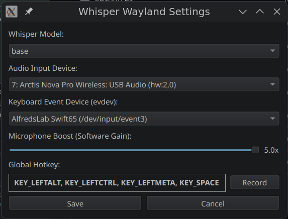

# Whisper Wayland

Whisper Wayland is a native, on-device voice-to-text (dictation) tool designed for Linux, with first-class support for Wayland (and X11 compatibility). It uses OpenAI's Whisper model (via `faster-whisper`) and Silero VAD to provide fast, accurate, and private transcription that injects text directly into your active window.


## Features

- **On-Device AI**: All transcription happens locally on your machine. No keys or data leave your computer.
- **Global Hotkey**: Trigger recording with a configurable system-wide shortcut (default: `Super+Space`).
- **Wayland Compatible**: Uses `evdev` for global input and `uinput` for text injection, bypassing Wayland's security restrictions on traditional key-loggers and injectors.
- **Premium UI**: Sleek system tray icon with distinct "record button" states.
- **Settings GUI**: Easy-to-use interface to change models, select audio devices, record new hotkeys, and adjust microphone boost.
- **Microphone Boost**: In-app software gain control for quiet microphones.
- **Automatic Fallback**: Gracefully falls back to CPU if no NVIDIA GPU/CUDA is detected.

## Installation

### Prerequisites

You will need `portaudio`, `python`, and `python-pip`.

On Arch Linux:
```bash
sudo pacman -S portaudio python-pip wl-clipboard
```

### Setup

1. **Clone the repository**:
   ```bash
   git clone https://github.com/jrufer/whisper-wayland.git
   cd whisper-wayland
   ```

2. **Create a virtual environment and install dependencies**:
   ```bash
   python -m venv venv
   source venv/bin/activate
   pip install -r requirements.txt
   ```

3. **Udev Rules (Required for Hotkeys/Injection)**:
   For the app to listen to your keyboard and inject text without root privileges, you need to add your user to the `input` and `uinput` groups and set up udev rules.
   
   Create `/etc/udev/rules.d/99-whisper-wayland.rules`:
   ```bash
   KERNEL=="uinput", GROUP="uinput", MODE="0660"
   ```
   Then reload rules and add yourself to the groups:
   ```bash
   sudo udevadm control --reload-rules && sudo udevadm trigger
   sudo usermod -aG input,uinput $USER
   ```
   *Note: You may need to log out and back in for group changes to take effect.*

## Usage

### Launching

- **From Terminal**:
  ```bash
  source venv/bin/activate
  python src/main.py
  ```
- **From GUI**:
  The project includes a `.desktop` file. On first run via terminal, it installs a shortcut to your applications menu. You can then search for "Whisper Wayland" in your launcher.

### How to Dictate

1.  **Hold** the hotkey (default: `Super+Space`).
2.  The tray icon will turn **red**, indicating it is recording.
3.  **Speak** clearly.
4.  **Release** the hotkey.
5.  The app will transcribe your speech and automatically **paste/type** it into your active window.

## Configuration & Features



The settings window allows you to fine-tune the dictation experience to match your hardware and preferences.

### 1. Whisper Model
Choose the AI model size that fits your system's performance:
- **Tiny/Base**: Extremely fast, low resource usage, good for clear speech.
- **Small/Medium**: Better accuracy, especially for accents or noisy environments.
- **Large-v3**: Highest accuracy, requires more VRAM/compute power.

### 2. Audio Input Device
Select your primary microphone from the list of detected system devices. The app supports a wide range of hardware, including USB headsets and professional interfaces.

### 3. Keyboard Event Device (evdev)
Since Wayland restricts global key-logging, Whisper Wayland listens directly to your keyboard's hardware events via `/dev/input`. If you have multiple keyboards (e.g., a laptop keyboard and a custom Swift65), you can select the specific device here.

### 4. Microphone Boost (Software Gain)
If the AI isn't picking up your voice at normal volumes, use the **Software Gain** slider to digitally amplify the signal (up to 5.0x). This ensures the Whisper model receives a clear signal even from quiet microphones.

### 5. Global Hotkey
Customizable trigger for recording. Click **Record**, then press your desired combination (e.g., `Ctrl+Alt+Super+Space`). The app will capture the raw hardware scancodes to ensure reliability across all Wayland compositors.

## License

MIT
